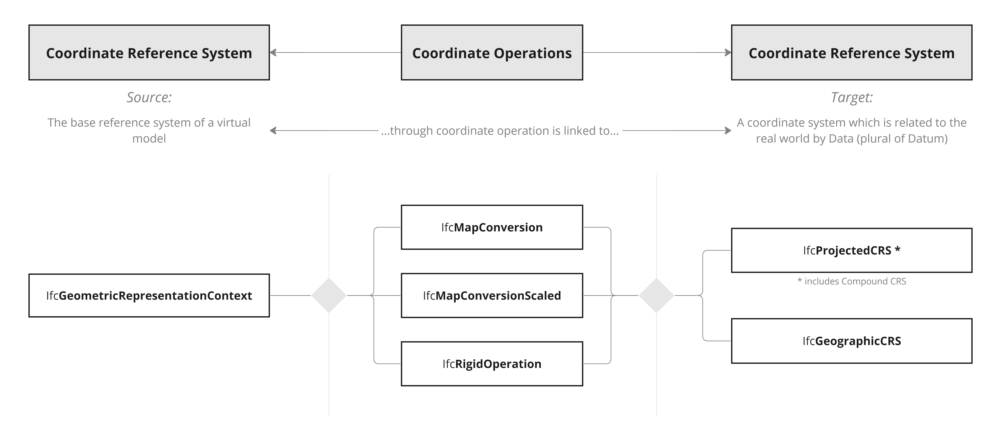

# IfcCoordinateOperation

The coordinate operation is an abstract supertype to handle any operation (transformation or conversion) between two coordinate reference systems (abbr., CRS).

By convention, a coordinate operation is given between the _SourceCRS_ being the more local (or child) coordinate reference system, and the _TargetCRS_ being the more remote (or parent) coordinate reference system.

A common coordinate operation is the one between the local engineering coordinate system of a construction project and any map or other coordinate reference system. In this case, _IfcCoordinateOperation_ is used to connect a _IfcGeometricRepresentationContext_ (the base reference system of a virtual model) to a _IfcCoordinateReferenceSystem_ (a coordinate system which is related to the real world by Data - as plural of Datum). To do this, _IfcCoordinateOperation_ can have:

- its SourceCRS attribute referring to _IfcGeometricRepresentationContext_
- its TargetCRS attribute referring to _IfcProjectedCRS_ or _IfcGeographicCRS_

The type of coordinate operation to be used depends on the specific use case. See _IfcMapConversion_, _IfcMapConversionScaled_, _IfcRigidOperation_ for details.

Figure 1 &mdash; Coordinate operation overview

{ .extDef}
> NOTE  in IFC, _IfcProjectedCRS_ can also be used to represent a Compound CRS. See _IfcProjectedCRS_ for further details.

> NOTE  Definition from OpenGIS Abstract Specification, Topic 2:
> If the relationship between any two coordinate reference systems is known, coordinates can be transformed or converted to another coordinate reference system. Coordinate operations are divided into two subtypes: { .note}
> * _Coordinate conversion_ &ndash; mathematical operation on coordinates that does not include any change of datum. The best-known example of a coordinate conversion is a map projection. The parameters describing coordinate conversions are defined rather than empirically derived. Note that some conversions have no parameters.
> * _Coordinate transformation_ &ndash; mathematical operation on coordinates that usually includes a change of datum. The parameters of a coordinate transformation are empirically derived from data containing the coordinates of a series of points in both coordinate reference systems. This computational process is usually &lsquo;over-determined&rsquo;, allowing derivation of error (or accuracy) estimates for the transformation. Also, the stochastic nature of the parameters may result in multiple (different) versions of the same coordinate transformation. Because of this several transformations may exist for a given pair of coordinate reference systems, differing in their transformation method, parameter values and accuracy characteristics.

> HISTORY  New entity in IFC4.

## Attributes

### SourceCRS
Source coordinate reference system for the operation.

### TargetCRS
Target coordinate reference system for the operation.
